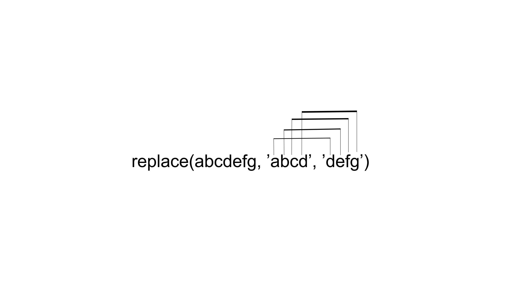

Cours Cosme 2019

# XSLT: approfondissement

Matthias Gille Levenson
23 avril 2019

---

# Les variables

Une variable est une donnée stockée dans la mémoire du programme de transformation: 

>« If we use logic to control the flow of our stylesheets, we’ll probably want to store tem-
porary results along the way. In other words, we’ll need to use variables. XSLT provides
the ``<xsl:variable>`` element, which allows you to store a value and associate it with a
name.»

Tidwell, D. (2008). *XSLT: Mastering XML Transformations.* 2nd ed. O’Reilly Media


En XSL, on utilise donc la fonction ``<xsl:variable>``. Une variable est  **nécessairement** définie par son nom à l'aide d'un attribut ``name``. 

On peut l'utiliser de deux façons: 

-  `` <xsl:variable name="nom"  select="valeur_a_capturer"/>``
- 
```
<xsl:variable name="nom">
        <xsl:value-of select="...">
</xsl:variable>
```    

Les variables sont appelées à l'aide du caractères dollar $:

- ``<xsl:value-of select="$ma_variable"/>``


On peut aussi se servir des variables pour filtrer précisément les données que l'on veut sélectionner et transformer. 

---

# Quelques fonctions xpath

## fn:concat()

La fonction ``concat()`` permet de fusionner deux chaînes de caractères (*strings*). La documentation de xpath la définit de la manière qui suit: 
>« fn:concat( 	$arg1 	 as xs:anyAtomicType?,
$arg2 	 as xs:anyAtomicType?,
... 	) as xs:string»

[W3C](https://www.w3.org/TR/xpath-functions-31/)

Les arguments passés sont des chaînes de caractères simples (sans espaces). Cette fonction est souvent utilisée pour manipuler des identifiants et des valeurs d'attributs.

## fn:translate()
Cette fonction est définie comme suit:

>fn:translate(string1,string2,string3)

Attention, la fonction translate convertit les caractères **un à un**:



### Exemple

- ``` translate(abcdefg, 'abcd', 'defg')``` donne 'defgefg'.
- ``` translate(abcdefg, 'dcba', 'defg')``` donne 'gfedefg'.

## fn:replace()
La fonction ``replace()`` permet de remplacer des chaînes de caractères en suivant un motif ( *pattern* ) défini. Cette fonction est définie ainsi: 

> fn:replace(string,pattern,replace)

### Exemple


- ``` replace(abcdefg, 'abcd', 'defg')``` donne 'defgefg'.
- ``` replace(abcdefg, 'dcba', 'defg')``` donne 'abcdef'.

---

# Exercices 
- Pour la liste des personnages, créer un index qui indique les scènes d'apparition. 
- Pour chaque personnage, créer un renvoi vers sa notice en début du document. 


