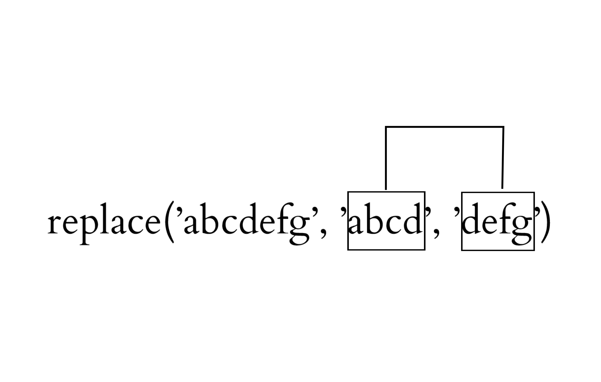

Cours Cosme 2019

# XSLT: approfondissement II

Matthias GILLE LEVENSON

23 avril 2019

---

# Quelques fonctions xpath
 Les fonctions Xpath suivantes permettent de manipuler des chaînes de caractère, et sont très utiles pour travailler sur des attributs et des identifiants en particulier. 
## fn:concat()

La fonction ``concat()`` permet de fusionner deux chaînes de caractères (*strings*). La documentation de xpath la définit de la manière qui suit: 
> «fn:concat(string,string,...)»

[W3C](https://www.w3schools.com/xml/xsl_functions.asp)

Les arguments passés sont des chaînes de caractères. Cette fonction est souvent utilisée pour manipuler des identifiants et des valeurs d'attributs.


## fn:replace()
La fonction ``replace()`` permet de remplacer des chaînes de caractères qui respectent un motif (*pattern*) défini. Si le motif est trouvé dans la chaîne de caractère, il est remplacé par le troisième argument. La syntaxe de cette fonction est définie ainsi: 

> «fn:replace(string,pattern,replace)»

[W3C](https://www.w3schools.com/xml/xsl_functions.asp)

où *string* est le noeud textuel à traîter. **Attention**, *string* peut être un noeud ou une chaîne de caractère (ce qui arrive peu souvent): **dans le second cas seulement**, il est nécessaire d'entourer la chaîne de guillemets simples ' '. ``replace()`` **convertit la chaîne de caractère en bloc si le motif est trouvé**:



### Exemple


- ``` replace('abcdefg', 'abcd', 'defghijk')``` donne 'defghijkefg'.
- ``` replace('abcdefg', 'dcba', 'defg')``` donne 'abcdefg': le motif n'a pas été trouvé.


## fn:translate()
La fonction ``fn:translate()`` permet aussi de remplacer des caractères, mais fonctionne de façon distincte. La syntaxe de cette fonction est définie comme suit:

> «fn:translate(string1,string2,string3)»

[W3C](https://www.w3schools.com/xml/xsl_functions.asp)

Le string1 est le noeud textuel à traiter, string2 les caractères à remplacer, string3 les caractères par lesquels les remplacer. 

**Attention**, comme pour la fonction précédente, *string1* peut être un noeud ou une chaîne de caractère: dans le second cas seulement, il est nécessaire d'entourer la chaîne de guillemets simples ' '. 

La principale différence avec ``replace()`` est que la fonction translate **convertit les caractères un à un**:


### Exemple

- ``` translate('abcdefg', 'abcd', 'defghijk')``` donne 'defgefg'.
- ``` translate('abcdefg', 'dcba', 'defg')``` donne 'gfedefg'.

---

# Les variables

Une variable est une donnée stockée dans la mémoire d'un programme, en l'occurrence ici du programme de transformation (**saxon** en géneŕal avec le programme Oxygen): 

>« If we use logic to control the flow of our stylesheets, we’ll probably want to store temporary results along the way. In other words, we’ll need to use variables. XSLT provides the ``<xsl:variable>`` element, which allows you to store a value and associate it with a name.»

Tidwell, D. (2008). *XSLT: Mastering XML Transformations.* 2nd ed. O’Reilly Media, p.167. 


En XSL, on utilise donc la fonction ``<xsl:variable>``. Une variable est  **nécessairement** identifiée à l'aide d'un attribut ``@name``. 

On peut l'utiliser de deux façons principales: 

- `` <xsl:variable name="nom"  select="valeur_a_capturer"/>``

- on peut aussi proposer la façon suivante: 

        
        <xsl:variable name="nom">
           règles à appliquer...
        </xsl:variable>
                

Les variables sont appelées à l'aide du caractères **dollar '$'**:

- ``<xsl:value-of select="$ma_variable"/>``


Une variable peut être globale (applicable à toute la feuille de transformation) ou propre à chaque *template*. Les variables sont utiles pour ne pas surcharger le code, et le rendre plus clair: si on doit réutiliser dans une règle ou dans une feuille de transformation en général la même valeur, on évite de réécrire plusieurs fois le même code. 

## Illustration

Imaginons une édition TEI avec un teiHeader qui comporte des informations précises sur les entités nommées du texte. Ces entités nommées sont donc présentées, définies, décrites dans le teiHeader, chacune a un identifiant unique ``@xml:id``. Chaque entité du corps du texte renvoie vers sa définition à l'aide d'un pointeur ``@target``. 

### Problème
Pour chaque entité nommée du texte, nous voulons récupérer les informations correspondantes qui sont dans le teiHeader, et les mettre dans une division avec un style pour donner un rendu que nous avons auparavant défini. Comment faire ? 

### Solution possible

On peut, pour résoudre ce problème, créer une règle disant d'aller chercher, quand on rencontre une entité nommée, l'information correspodant dans les métadonnées du teiHeader (dans le noeud avec un ``@xml:id`` correspondant), et de l'imprimer. Nous allons voir comment faire dans l'exercice suivant, en utilisant les variables.


---


## Exercices 
- Créer une notice pour chaque personnage listé dans la ``<listPerson>``. Chaque notice devra contenir la description et les liens renvoyant vers la fichier wikipedia et wikidata. 

        <xsl:template match="person">
            <xsl:variable name="id_person" select="@xml:id"/>
                <div id="{@xml:id}">
                    <h3>
                        <xsl:value-of select="persName"/>
                    </h3>
                    <p>
                        <xsl:apply-templates select="note"/>
                        <br/>
                        <xsl:text>Références:</xsl:text>
                        <a href="{descendant::ref[@type = 'wiki']/@target}">
                            <xsl:value-of select="bibl/ref[@type = 'wiki']/@target"/>
                        </a>
                        <br/>
                    </p>
                </div>
        </xsl:template>        
Cette règle met en forme les notices; il reste maintenant à les imprimer dans une division précise, dans la règle qui sélectionne la racine:

        <div id="notices_personnages">
            <h3>Notices: personnages</h3>
            <xsl:apply-templates select="//person"/>
        </div>


- Pour chaque nom de personnage qui apparaît dans le corps du texte **et qui est listé dans cette ``<listPerson>``**, créer un lien vers sa notice en début du document:


      <xsl:template match="persName[@ref]">
            <!--Récupérer l'id du persName-->
            <xsl:variable name="id_persName" select="translate(@ref, '#', '')"/>
            <!--Récupérer l'id du persName-->
            <!--Appliquer la règle uniquement aux noms de personnages qui sont listés dans la notice, et pas  dans la liste des personnages-->
            <xsl:choose>
                <xsl:when test="//person[@xml:id = $id_persName]">
                    <!--faire un lien vers cette notice-->
                    <a href="{@ref}">
                        <xsl:apply-templates/>
                    </a>
                    <!--faire un lien vers cette notice-->
                </xsl:when>
                <xsl:otherwise>
                    <xsl:apply-templates/>
                </xsl:otherwise>
            </xsl:choose>
            <!--Appliquer la règle uniquement aux noms de personnages...-->
            </xsl:template>
Attention, sur la XSL fournie, cette règle n'aura pas d'effet. Pourquoi? 

        <xsl:template match="l">
            <div class="verse" id="{@xml:id}">
                <!-- Ici le Xpath de @select permet de récupérer plusieurs valeurs :
                - le texte enfant des <l>
                - le texte enfant des desc[@type='letter']
                - le texte enfant des <c> -->
                <xsl:apply-templates
                    select="text() | figure/desc[@type = 'letter']/text() |c/text()"/>
            </div>
        </xsl:template>
``<persName/>`` est enfant de ``<l/>``; or la règle qui traite ``<l/>`` limite indique les noeuds enfants qui peuvent être traités par les autres règles (``<xsl:apply-templates select="text() | figure/desc[@type = 'letter']/text() |c/text()"/>``): il faut indiquer que les règles qui portent sur ``persName`` doivent aussi s'appliquer:

        <xsl:template match="l">
            <div class="verse" id="{@xml:id}">
                <!-- Ici le Xpath de @select permet de récupérer plusieurs valeurs :
                - le texte enfant des <l>
                - le texte enfant des desc[@type='letter']
                - le texte enfant des <c> -->
                <!--Maj matthias: appliquer les règles sur toutes les balises mentionnées + sur les persName-->
                <xsl:apply-templates
                    select="text() | figure/desc[@type = 'letter']/text() |c/text() | persName"/>
            </div>
        </xsl:template>
        

---


# Bonus. Jongler avec plusieurs documents d'entrée et de sortie. 


---

## ``fn:collection()``

La fonction Xpath ``collection()`` permet de travailler avec plusieurs documents d'entrée, et d'importer plusieurs documents xml différents. Sa syntaxe est la suivante: 

> «fn:collection(string)»

[W3C](https://www.w3schools.com/xml/xsl_functions.asp)

Où *string* (**entre guillemets**) est un URI, en général un URL.  Une fois le ou les documents sélectionné.s entre les parenthèses, on emploie une expression Xpath: 

        <xsl:value-of select="collection('...Hugo/romans/*.xml')//teiHeader//title"/>
        
Cette expression Xpath doit sélectionner et imprimer les titres de tous les fichier xml qui sont dans le dossier indiqué.

---

## ``<xsl:result-document/>``

Cette fonction xsl permet d'arriver au résultat inverse: produire plusieurs documents de sortie. Cette fonction ordonne la création d'un nouveau document de sortie. L'atttribut ``href``, qui indiquera l'URI du document créé (et en déterminera donc le nom), est obligatoire: 

        <xsl:template match="...">
            <xsl:result-document href="fiches_temoins/fiche_temoin_{$id_temoin}.html">
              <html>
              ....
              </html>
            </xsl:result-document>
        </xsl:template>
        
 Cet exemple permet de créer des fiches témoins au format html avec un nom dépendant d'une variable définie dans la template, ou plus haut dans la feuille de style.
 
 **N.B.**: Si ces deux fonctions sont nécessaires pour vous, il est probable que vous tirerez grand profit de l'utilisation des bases de données XML et du langage d'interrogation correspondant XQuery: ``fn:collection()``, en particulier, est aussi une fonction XQuery. Un bon point de départ est le livre de Walmsey: 
 
Walmsley, P. (2015). *XQuery*. 2st ed. Beijing ; Sebastopol, Calif: O’Reilly.


