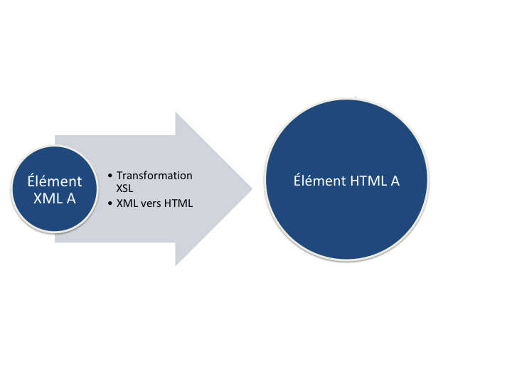
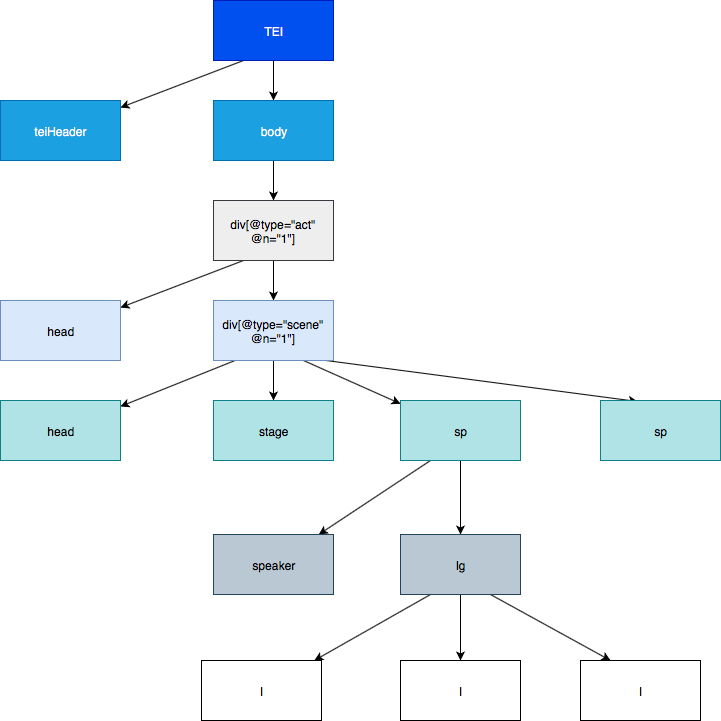
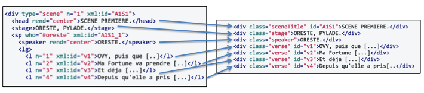
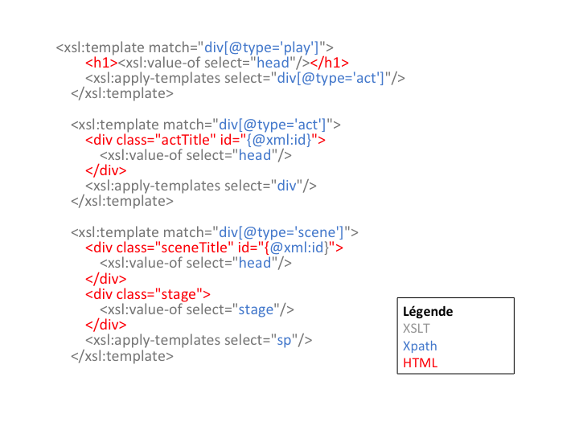

Cours Cosme 2019

# XPath et fondamentaux du langage XSLT

Ariane Pinche
Lyon, 23 avril 2019

---
# I- XSLT et l'environnement XML 

---

« **XSLT** (extensible Stylesheet Language Transformations) est un langage de programmation fonctionnel utilisé pour spécifier comment un document XML doit être transformé en un autre document qui peut, mais qui n’est pas nécessairement, un autre document XML.

Un processeur XSLT lit un arbre XML en entrée et une feuille de style XSL et produit un arbre résultat en sortie. »

Elliotte Rusty Harold, W. Scott Means, Philippe Ensarguet [et al.], *XML en concentré*, Paris, O’Reilly, 2005, p. 519.

---

---

---

# II- XPath

* Xpath 2.0 est publié par le *World Wide Web Consortium* (W3C) et s’inscrit dans la famille des standards XML;

* Xpath est un langage de requêtes qui permet de parcourir un arbre XML;

* Xpath a été conçu comme un langage intégré, et non pas un langage autonome; 
	
* **Attention** : Xpath est un « read-only » langage. 

 

Pour aller plus loin : Michael R. Kay, *XPath 2.0 programmer’s reference*, Indianapolis, IN, Wrox Press, 2004. p.1-5.

---

## 1- Bases de la syntaxe Xpath

- Xpath permet d'exprimer un chemin vers un élément d'un arbre.
- Une expression de chemin correspond à une séquence d’étapes séparées par l’opérateur « / ». 
	- *TEI/body/div/head*	

**Sans indication particulière, la relation se fait d’un élément parent vers un élément enfant.**

###### Pour en savoir plus :
Michael R. Kay, *XPath 2.0 programmer’s reference*, Indianapolis, IN, Wrox Press, 2004, p.215-216.

---
*Arbre simplifié du document XML *Andromaque**
 

---
###### Exercices

**Quels éléments sont sélectionnés par les chemins suivants ?**

- TEI/body/div/div;
- TEI/body/div/div/head;
- TEI/body/div/div/sp.

**À partir de l’arbre XML simplifié d’*Andromaque* donner les chemins suivants en partant de l’élément racine TEI**

- Donner le chemin vers "body";
- Donner le chemin vers la "div" dont l'attribut type est égal à "act";
- Donner le chemin vers "stage";
- Donner le chemin vers "speaker";
- Donner le chemin vers les "l".
---
## 2- Les principaux axes Xpath
- *child axis* : sélectionne les éléments et les textes des nœuds enfants
	- body/teiHeader  
- *descendant axis* : sélectionne les noeuds descendants directs ou indirects d'un élément
	- body//div 
- *parent axis* : sélectionne l’élément parent d'un élément
	- div/parent::body 
- ancestor axis : sélectionne tous les éléments parents directs ou indirects en remontant jusqu’à l’élément racine
	- l/ancestor::sp
- *attribute axis* : sélectionne l'attribut d’un élément
	- div/@type
---
###### Exercices

---

---

---
**À partir de l’arbre XML simplifié d’*Andromaque*, donner les chemins suivants avec la syntaxe la plus concise possible :**

- Donner le chemin vers la "div" dont l'attribut type est égal à "act" depuis la racine;
- Donner le chemin vers "stage";
- Donner le chemin depuis "l" vers "sp";
---

## 3-Les prédicats Xpath

Pour affiner sa requête Xpath, on peut ajouter des **prédicats**. 
Le prédicat est noté entre crochets droits après l'élément auquel il se rapporte. 

- On peut ainsi spécifier la position d'un élément :
	- l[1]
- Une propriété de l'élément :
	- div[@type="scene"] 
---
# III-XSLT
---

## Transformation XSLT vers HTML

---

## Syntaxe XSLT

---
## Initier un fichier XSLT
